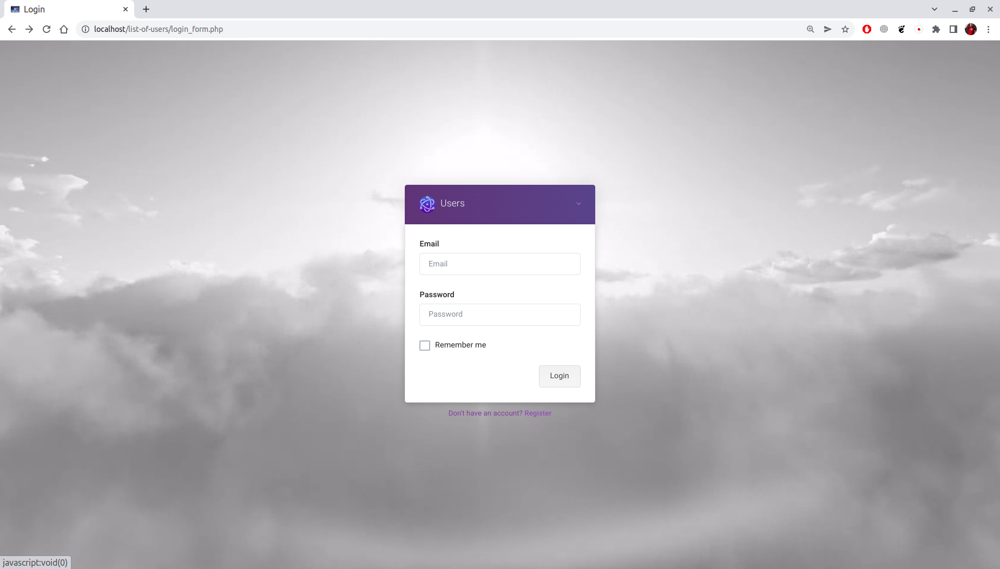
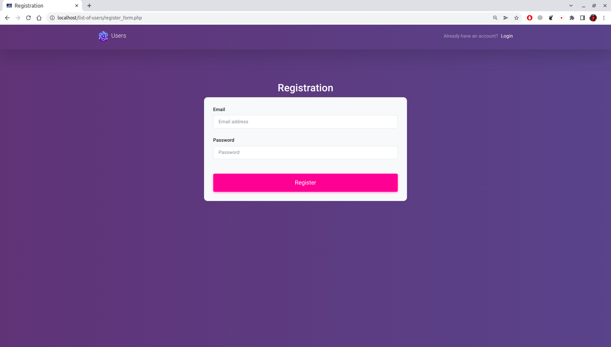
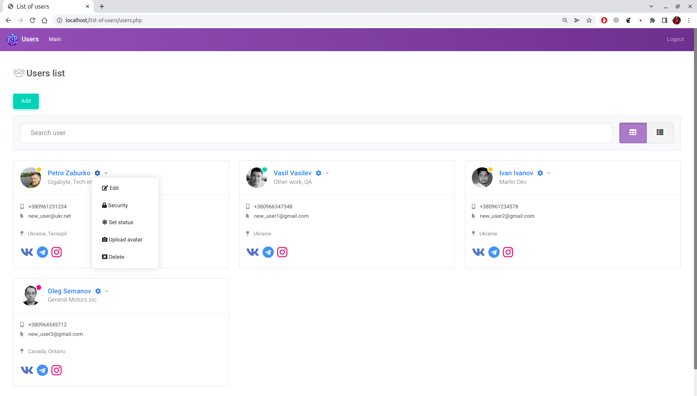
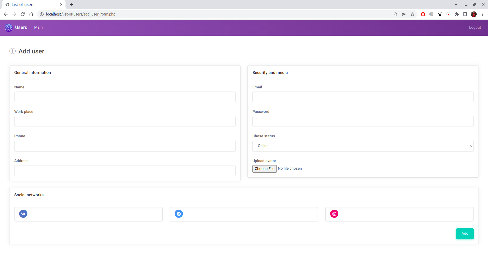
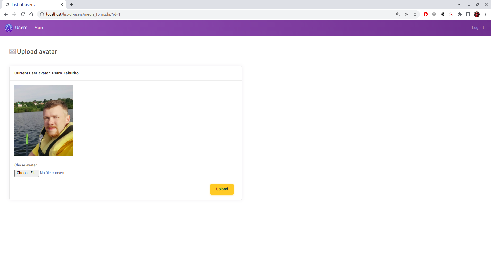
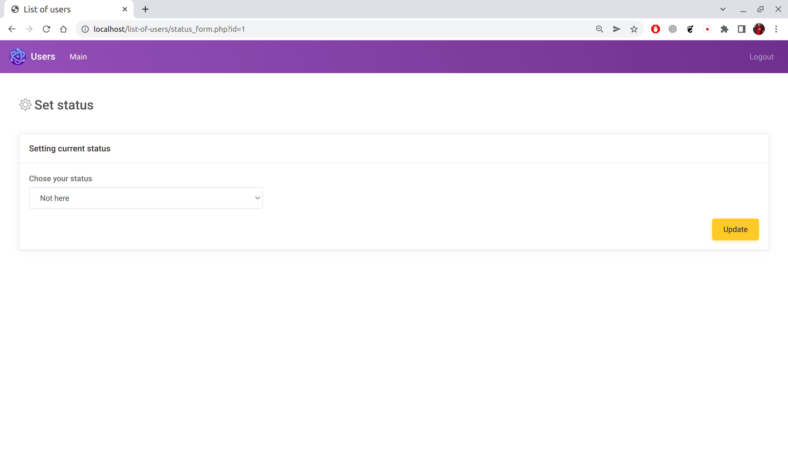

## About
A simple web application, list of users, written in procedural style. Implemented CRUD methods to access users and implemented several roles : user and admin.

Login page:

Register page:

List of all users:

Adding new user page:

All info about user:

Adding/changing user avatar page:

Setting user status page:

